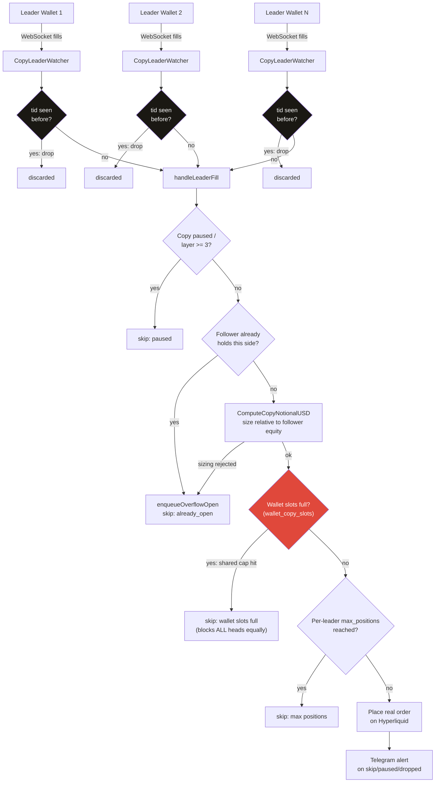
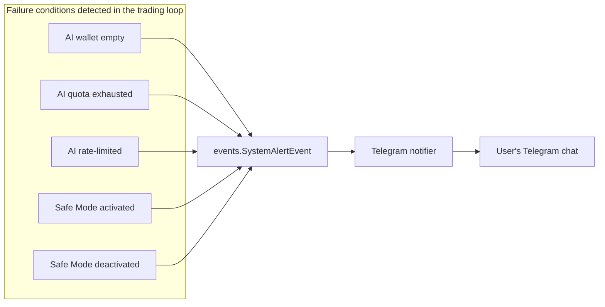

# Hydra Trader

### A fork of [NoFxAiOS/nofx](https://github.com/NoFxAiOS/nofx), extended with a multi-leader Hyperliquid copy-trading engine

## Table of Contents

- [Summary](#summary)
- [Technologies](#technologies)
- [Setup](#setup)
  - [Prerequisites](#prerequisites)
  - [Instructions](#instructions)
- [Features](#features)
- [Architecture](#architecture)
  - [AI-decision trading](#ai-decision-trading)
  - [Copy trading](#copy-trading)
- [How It Works](#how-it-works)
  - [Leader-fill mirroring and deduplication](#leader-fill-mirroring-and-deduplication)
  - [Two-tier position caps](#two-tier-position-caps)
  - [Overflow queue](#overflow-queue)
  - [Telegram alerting](#telegram-alerting)
  - [Hard exits](#hard-exits)
- [Known Limitations](#known-limitations)
- [Status](#status)
- [License and Credits](#license-and-credits)

## Summary

Hydra Trader is an AI-decision crypto trading system built on top of
[NOFX](https://github.com/NoFxAiOS/nofx), an open-source multi-AI-model trading
platform. Upstream NOFX gives a trader an AI model, an exchange connection,
and a strategy; this fork keeps that core and adds a second trading mode on
top of it — a multi-leader Hyperliquid copy-trading engine that mirrors one
or more leader wallets' live fills into a follower account, with its own
position caps, deduplication, and failure handling.

The name comes from that second mode: one account can run a single
AI-decision trader on Bitget alongside a fleet of independent copy-trading
"heads," each mirroring a different Hyperliquid leader wallet, all sharing
one margin pool with a wallet-wide safety cap that no individual head can
exceed — one account, many heads.

This repository is published as a reference implementation, not a running
service. The project traded real capital on Bitget and Hyperliquid from
mid-August through early September 2026, and was deliberately wound down:
all cloud infrastructure has been decommissioned and every exchange API key
used by this project has been revoked. What's here is the actual code that
ran, organized into a clean commit history, for anyone who wants to read it,
run it locally in a paper-trading/backtest capacity, or build on it.

This is a fork under the same license as upstream. See
[License and Credits](#license-and-credits) before using any part of it.

## Technologies

- **Go 1.25** — backend: trading engine, exchange integrations, REST API
- **React 18 + TypeScript 5** — frontend dashboard, built with Vite
- **Tailwind CSS** — frontend styling
- **GORM**, with **SQLite** (default, file-based) or **PostgreSQL** (configurable) — persistence
- **Bitget UTA v3 API** — Unified Trading Account perpetuals
- **Hyperliquid API + WebSocket** — perpetuals trading and live leader-fill streaming
- **Telegram Bot API** — alerts and interactive bot control
- **Docker** — `docker/Dockerfile.backend` and `docker/Dockerfile.frontend` for a standard two-container deploy

## Setup

### Prerequisites

- [Go](https://go.dev/dl/) 1.25 or later
- [Node.js](https://nodejs.org/) 20 or later, for the `web/` frontend
- [Docker](https://www.docker.com/) and Docker Compose, if you want a containerized run instead of running the backend and frontend directly

### Instructions

1. Clone the repository:

   ```
   git clone https://github.com/dunksmaster/hydra-trader.git
   cd hydra-trader
   ```

2. Copy `.env.example` to `.env` and fill in your own values. At minimum you'll need `JWT_SECRET`, `DATA_ENCRYPTION_KEY`, and `RSA_PRIVATE_KEY` (all generated locally, not shared secrets), plus your own exchange and AI-model API keys entered through the app itself once it's running — none of this project's own keys are in the repository or the `.env.example` file.

3. Run the backend:

   ```
   go run .
   ```

4. In a separate terminal, run the frontend:

   ```
   cd web
   npm install
   npm run dev
   ```

   Or build and run both with Docker using `docker/Dockerfile.backend` and `docker/Dockerfile.frontend`.

## Features

- AI-decision trading on Bitget UTA v3, with a pluggable model backend (NVIDIA/Nemotron, OpenAI-compatible providers, and others)
- Multi-leader Hyperliquid copy-trading: mirror any number of leader wallets into one follower account independently
- Two-tier position caps (per-leader and wallet-wide) so multiple copy heads sharing one wallet can never collectively exceed its real capacity
- `tid`-based fill deduplication so a redelivered WebSocket message is never mirrored twice
- An overflow queue for skipped opens (cap hit, already holding the side) instead of a silent drop
- Loss-streak auto-pause for a leader that starts losing repeatedly
- Code-enforced hard take-profit and hard stop-loss, independent of the AI model's own decisions
- Telegram system alerts (wallet empty, AI quota exhausted, rate-limited, Safe Mode toggled, copy paused/evicted) — upstream had none of this
- An interactive Telegram control surface: close a position, view leaders and their layer/pause state, switch copy-strategy profiles, and pull per-trader/per-venue performance reports, all from chat
- A copy-trading bots dashboard in the web UI, showing every head's leader, layer, live account state, and shared wallet capacity in one view
- Encrypted-at-rest credentials (exchange API keys, Telegram bot token) using AES-GCM, with a fail-closed decryption path

## Architecture

This fork runs two distinct trading modes side by side, on the same account infrastructure but with independent logic.

### AI-decision trading

A single trader is given an AI model, an exchange connection (Bitget UTA v3 in this fork's primary deployment), and a strategy — a coin source, risk controls, and prompt configuration. Each cycle, the engine gathers market data and current positions, sends them to the model, parses a decision, and executes it. A code-enforced hard take-profit/stop-loss runs independently of the model, so a bad or slow model response can't leave a position unmanaged.

### Copy trading

Each copy-trading "head" is a separate trader instance pointed at one Hyperliquid leader wallet address. It subscribes to that wallet's live fills, sizes a mirrored order proportionally to the follower's equity relative to the leader's, and applies its own position caps before ever placing an order. Multiple heads can share one Hyperliquid wallet; a wallet-wide cap is checked before any individual head's own cap, so the shared resource is always protected first.

## How It Works

### Leader-fill mirroring and deduplication

`CopyLeaderWatcher` subscribes to a leader wallet's fills over Hyperliquid's WebSocket. Each fill carries a `tid` (trade ID); a ring-buffer of seen `tid`s means a redelivered message is dropped before it ever reaches the mirroring logic, so a WebSocket reconnect or a duplicate push can't cause a double-open.



### Two-tier position caps

Every copy head has its own `max_positions` cap, but every wallet also has a `wallet_copy_slots` cap. The wallet cap is checked first — so if five heads share one wallet with a slot cap of 3, the fourth and fifth heads' opens are skipped regardless of what their own individual caps allow. The shared resource is protected before any single head's preferences are.

### Overflow queue

An open that's skipped — a cap hit, or the follower already holding that side — isn't silently dropped. It's logged with a specific skip category and queued via the overflow mechanism, persisted so it survives a restart, and can be handed to another trader with free capacity instead of being lost.

### Telegram alerting

Failure conditions that upstream only ever logged to the server now raise a real alert to the bound Telegram chat:



Copy-specific events (a leader paused, evicted, or hitting a loss streak) raise the same kind of alert. Beyond alerts, the Telegram bot also gives real control: closing a position, switching a copy-strategy profile, or checking a leader's current state, all from chat.

### Hard exits

Independent of what the AI model decides, a strategy can set a hard take-profit and hard stop-loss margin percentage. Every cycle, any open position that has crossed either threshold is force-closed by the code, not the model — this is what kept a slow or wrong model response from leaving a position unmanaged.

## Known Limitations

Stated honestly, not glossed over:

- **All order execution uses IOC (Immediate-Or-Cancel) exclusively.** Every open, close, stop-loss, and take-profit pays taker fees. No maker-fee (GTC) path exists for copy-trading or AI-decision opens.
- **`GetPositions()` staleness is unconfirmed** as a possible cause of rapid same-symbol re-opens on high-frequency leaders — raised during live operation, never fully resolved.
- **No backtesting existed while this was live.** Every strategy and risk-setting change was validated by watching it trade with real money, not before deployment.
- **One trader, "Crypto BigG," suffered a real -99.6% equity loss** during live operation, with no conclusive causal trail found in the application's own logs. This is stated here as an honest engineering lesson: the system did not have a circuit breaker that would have prevented an account from being drawn down this far.

## Status

This project traded real capital on Bitget and Hyperliquid from mid-August through early September 2026. It was deliberately wound down on 2026-09-03: all cloud infrastructure was deleted, and every exchange API key the project used was revoked. This was a decision to stop risking live capital, not a response to any single incident.

Ongoing work, if any, is local-only paper-trading and backtesting against historical leader-fill data — running the same copy-trading logic against a simulated balance, with no exchange risk. There is no live deployment of this code and none is currently planned.

## License and Credits

This project is licensed under **AGPL-3.0**, inherited unchanged from upstream — see [`LICENSE`](LICENSE). The AGPL's network-service clause means that running a modified version of this code as a live service to users obligates making that modified source available to those users; upstream (NoFxAiOS) has actively enforced this against at least one other project (see `docs/legal/AGPL-VIOLATION-REPORT-ChainOpera-EN.md` in this repository).

This project is built directly on top of [NoFxAiOS/nofx](https://github.com/NoFxAiOS/nofx) — all of the AI-decision trading core, the exchange integration framework, and the web dashboard's foundation come from that project. This fork's own contribution is the Hyperliquid copy-trading engine, the Telegram alerting and control surface, Bitget UTA v3 support, and the operational fixes documented in this repository's commit history.
