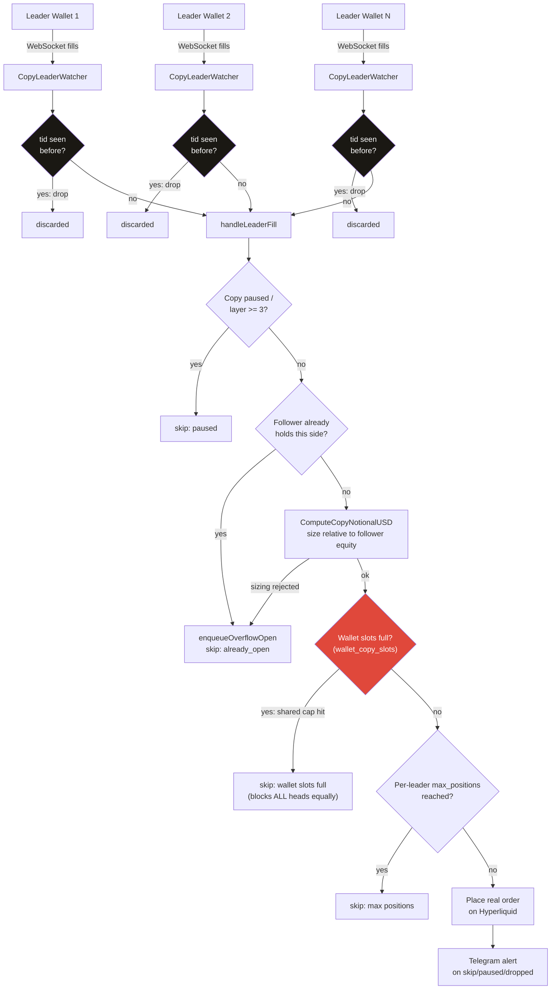
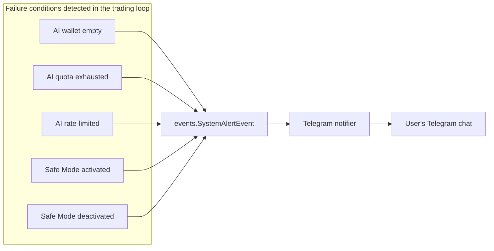

# Hydra Trader — Architecture Beyond Upstream NOFX

**Fork of:** [NoFxAiOS/nofx](https://github.com/NoFxAiOS/nofx) (AGPL-3.0)

Upstream NOFX already documents its own architecture in `docs/architecture/` — this file
covers only what's original to this fork: an AI-decision trading core extended with a
multi-leader Hyperliquid copy-trading engine.

## Why "Hydra"

One account, many heads: a single AI-decision trader (Bitget) runs alongside a fleet of
independent copy-trading "heads," each mirroring a different Hyperliquid leader wallet,
all sharing one margin pool with a wallet-wide safety cap that no individual head can
exceed.

## Copy-trading engine — leader fill to follower order

**The one thing worth understanding about this design:** the wallet-wide slot cap
(`wallet_copy_slots`) is checked *before* any individual head's own `max_positions`
cap. That means N leaders sharing one Hyperliquid wallet can never collectively exceed
the wallet's real capacity, even if every individual head's own cap would allow more —
the shared resource is protected first, per-head limits are secondary.

## System alerting

Upstream NOFX had no equivalent — failures were previously visible only in server logs.

## Known limitations (see PUBLISH-CHECKLIST.md for the full list)

- All order execution uses IOC (Immediate-Or-Cancel) — no maker-fee path exists anywhere
  in the copy-trading or AI-decision order flow.
- No backtesting — every strategy change is validated live, with real money.
